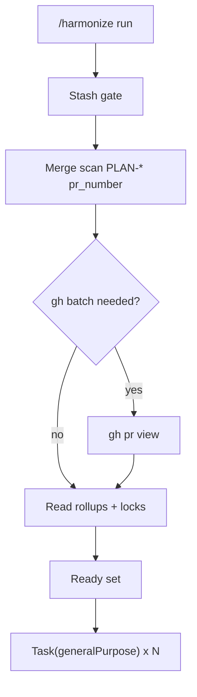

# Harmonize on Cursor IDE

This document is the **canonical Cursor mapping** for the harmonize plugin. Claude Code agents use
named sub-agents (`Agent(subagent_type: harmonize)`, …) and task APIs (`TaskCreate`, `TaskStop`, …).
Cursor exposes a different tool surface: **generic background `Task`**, **no `Skill()`**, and **no
task registry APIs**. Behaviors and file semantics stay the same; **only dispatch mechanics change**.

## Source of truth

| Artifact | Path (plugin root = directory containing `skills/` and `agents/`) |
|----------|-------------------------------------------------------------------|
| Master playbook | `agents/harmonize.md` |
| This mapping | `docs/cursor-host.md` |
| Master skill | `skills/harmonize/SKILL.md` |

When developing the marketplace locally, plugin root is often **`~/Code/workflow/harmonize`**. When
installed from Cursor, resolve the unpacked plugin directory from your editor or marketplace layout.

## Capability gap (Claude Code → Cursor)

| Claude Code | Cursor host |
|-------------|-------------|
| `Agent(subagent_type: harmonize)` | `Task(subagent_type: generalPurpose, …)` + prompt cites `agents/harmonize.md` |
| `Agent(subagent_type: plan-orchestrator)` | Same: `Task` + `agents/plan-orchestrator.md` |
| `Skill(harmonize)` | `Read` on `skills/harmonize/SKILL.md` |
| `TaskCreate` / `TaskList` / `TaskGet` / `TaskStop` / `TaskOutput` | **Absent** — use `in-flight.md` as a **log**, flush when trees die |
| `CronList` / `CronCreate` | **Absent** — log “cron skipped” on `phase-plan.md`; rely on manual `/harmonize` |
| `AskUserQuestion` | May exist — if **absent** and run lock is contentious, **stop** with a summary |

## Run flow (high level)

[Edit diagram](https://mermaid.live)

## First assistant turn (`run`)

1. **`Read`** `skills/harmonize/SKILL.md` (if not already in context).
2. Run **`agents/harmonize.md`** **§0** stash gate in the foreground (`git` on **`REPO`**).
3. **Background:** call **`Task`** with **`run_in_background: true`**, **`subagent_type`:
   `generalPurpose`** (or the host’s generic worker), prompt **must** include:
   - `mode: run`
   - `repo: <absolute path to primary checkout>`
   - Instruction to follow **`agents/harmonize.md`**, and **`docs/cursor-host.md`** for Cursor rules.
4. **No `Task` tool:** run **`agents/harmonize.md`** inline in the same conversation (no nested
   named agents).

## Unblock workflow (gh pass) without task await

When **`TaskGet` / `TaskOutput`** are missing:

1. **`rg`** (or `grep`) `docs/plans/progress/PLAN-*.md` for numeric **`pr_number`** (and PR URLs).
2. If **none**, the **`unblock-workflow-gh`** step is a **no-op** — proceed to post-merge steps in the **same** turn.
3. If present, run **`gh pr view`** for each id, update `PLAN-*` + rollups, then proceed.
4. **Never** `sleep` waiting on a background gh task.

## Post-merge dispatch (`§6–§9`)

In one user-visible batch, spawn **separate** **`Task(generalPurpose)`** calls for each orchestrator
that Claude Code would spawn as **`Agent(subagent_type: …)`**:

- `plan-orchestrator` — prompt: `mode: dispatch-only — repo: <REPO>`
- `specify-orchestrator` — include ready list (may be empty)
- `design-orchestrator` — include ready list (may be empty)

Each prompt should name the **`agents/<name>.md`** file to follow. Orchestrators **must** still fan
out **`plan-implementer` / `pr-reviewer`** via **`Task`** the same way (breadth over serial).

## `in-flight.md` on Cursor

- Treat rows as **advisory** (human + IDE visibility).
- On **`/harmonize run`** root, if the registry was non-empty and task APIs are absent, **flush** to
  `[]` per skill (restart sweep).
- When the user **kills** background tasks, run **`/harmonize reset-in-flight`** or flush manually.
- **Do not** assume `task_id` values are stoppable from the repo.

## Run lock (`harmonize-run-lock.md`)

Same file semantics as Claude Code. If **`AskUserQuestion`** is unavailable and §0b hits contention,
**stop** and print options (cancel / clear lock / cancel other work) for the user.

## Install reminder (Cursor)

Install the **`harmonize`** plugin from the **`cjhowe-us-workflow`** marketplace mirror; hooks live
under **`.cursor-plugin/plugin.json`**. See the root [**README**](../../README.md).

## Task recovery hooks (Cursor)

Cursor’s **`subagentStop`** hook only applies `followup_message` when the Task **`status`** is
`completed` (see [Cursor hooks](https://cursor.com/docs/hooks)). When a **plan-orchestrator**
(supervisor) or **`mode: run`** harmonize master Task ends with **`error`** or **`aborted`**,
`subagent-stop-worktree-state.sh` writes **`docs/plans/.cursor-hook-restart-pending.json`** (ignored
by git). The next **`stop`** hook run consumes that file and auto-submits a **`followup_message`**
that tells the parent session to re-dispatch the correct background Task. If the main agent loop
ends with **`error`** / **`aborted`** while **`harmonize-run-lock.md`** still has **`active: true`**
(and there is no pending file), **`harmonize-cursor-stop-followup.sh`** submits a follow-up to
re-run default **`/harmonize`** (`mode: run`).

**Every `subagentStop`:** after worktree roster updates, **`subagent-stop-unblock-workflow.sh`** runs.
It always writes **`docs/plans/.cursor-hook-unblock-pending.json`** with **`last_unblock_hook_at`**
(so the hook is observable even when it does nothing else). When no duplicate harmonize work is
in flight, it emits **`followup_message`** to run **`mode: unblock-workflow`** (full gh pass + post-merge
dispatch). It skips emitting when **`harmonize-run-lock.md`** is **`active: true`**, **`in-flight.md`**
already lists a **`plan-orchestrator`** row for **`unblock-workflow-gh`** / **`merge-detection`**, or
**`last_followup_emit_epoch`** is within **`HARMONIZE_UNBLOCK_HOOK_DEBOUNCE_SEC`** (default **90**)
seconds — so rapid nested **`SubagentStop`** events do not enqueue duplicate follow-ups.
